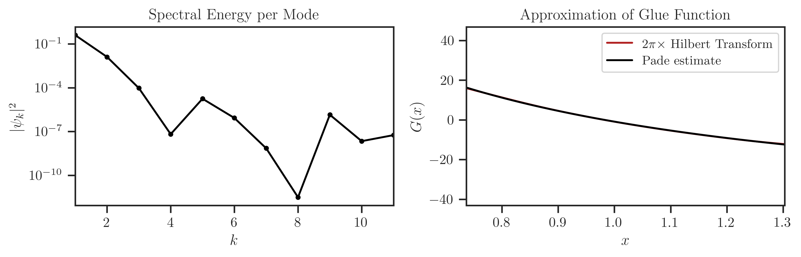
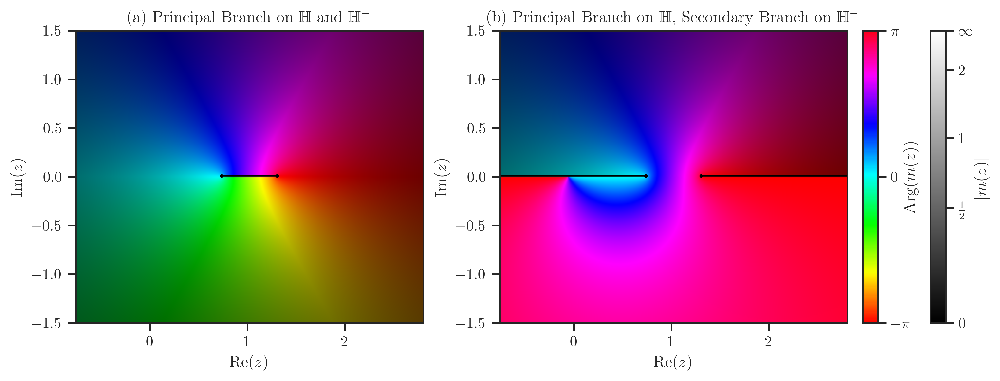
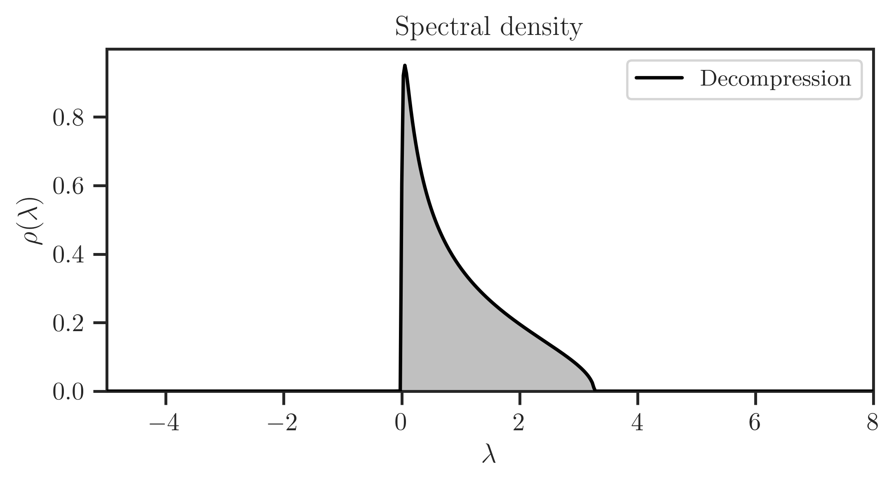

.. meta::
   :description: freealg is a Python package that employs free probability to evaluate the spectral densities of large matrix forms.

.. module:: freealg

|project| Documentation
***********************

.. grid:: 4

    .. grid-item-card:: GitHub
        :link: https://github.com/ameli/freealg
        :text-align: center
        :class-card: custom-card-link

    .. grid-item-card:: PyPI
        :link: https://pypi.org/project/freealg
        :text-align: center
        :class-card: custom-card-link

    .. grid-item-card:: Quick Usage
        :link: quick_usage
        :link-type: ref
        :text-align: center
        :class-card: custom-card-link

    .. grid-item-card:: API reference
        :link: api
        :link-type: ref
        :text-align: center
        :class-card: custom-card-link

.. grid:: 4

    .. grid-item-card:: Paper
        :link: https://arxiv.org/pdf/2506.11994
        :text-align: center
        :class-card: custom-card-link

    .. grid-item-card:: Slides
        :link: https://www.dropbox.com/scl/fi/03gjuyz17k9yhsqy0isoz/free_decomporession_slides.pdf?rlkey=8f82mhciyl2ju02l7hv1md5li&st=26xmhjga&dl=0
        :text-align: center
        :class-card: custom-card-link

    .. grid-item-card:: Live Demo
        :link: https://colab.research.google.com/github/ameli/freealg/blob/main/notebooks/quick_start.ipynb
        :text-align: center
        :class-card: custom-card-link

.. .. grid-item-card:: Slides
..     :link: _static/data/slides.pdf
..     :text-align: center
..     :class-card: custom-card-link

Install
=======

|pypi|

Install with ``pip``:

.. prompt:: bash
    
    pip install freealg

Alternatively, clone the source code and install with

.. prompt:: bash
   
    cd source_dir
    pip install .

.. _quick_usage:

Quick Usage
===========

Generate a matrix with its spectral density following Marcheno-Pastur law
using :class:`freealg.distributions.MarchenkoPastur`:

.. code-block:: python

    >>> from freealg import FreeForm
    >>> from freealg.distributions import MarchenkoPastur
    >>> import numpy
    >>> mp = MarchenkoPastur(1/50)
    >>> A = mp.matrix(3000)
    >>> eig = numpy.linalg.eigvalsh(A)

Create a :class:`freealg.FreeForm` object

.. code-block:: python

    >>> from freealg import FreeForm
    >>> ff = FreeForm(eig, support=(mp.lam_m, mp.lam_p))

Fit its density using Chebyshev method using :func:`freealg.FreeForm.fit`.
Alternative method is Jacobi polynomial.

.. code-block:: python

    >>> psi = ff.fit(method='chebyshev', K=10, alpha=2, beta=2, reg=0,
    ...              damp='jackson', force=True, pade_p=1, pade_q=1, plot=True)

Estimate density using :class:`freealg.FreeForm.density`:

.. code-block:: python

    >>> x = numpy.linspace(lam_m-2, lam_p+2, 300)
    >>> rho = ff.density(x, plot=True)

Estimate Hilbert transform using :class:`freealg.FreeForm.hilbert`:

.. code-block:: python

    >>> hilb = ff.hilbert(x, rho, plot=True)

Estimate Stieltjes transform with :class:`freealg.FreeForm.stieltjes`:

.. code-block:: python

    >>> x = numpy.linspace(lam_m-1.5, lam_p+1.5, 300)
    >>> y = numpy.linspace(-1.5, 1.5, 200)
    >>> mp, mm = ff.stieltjes(x, y, p=2, q=2, plot=True)

Decompress spectral density to a larger matrix with
:func:`freealg.FreeForm.decompress`:

.. code-block:: python

    >>> rho = ff.decompress(100000, plot=True)

API Reference
=============

Check the list of functions, classes, and modules of |project| with their
usage, options, and examples.

.. toctree::
    :maxdepth: 2
   
    API Reference <api>

Test
====

|build-linux|

You may test the package with `tox <https://tox.wiki/>`__:

.. prompt:: bash

    cd source_dir
    tox

Alternatively, test with `pytest <https://pytest.org>`__:

.. prompt:: bash

    cd source_dir
    pytest

How to Contribute
=================

We welcome contributions via GitHub's pull request. Developers should review
our :ref:`Contributing Guidelines <contribute>` before submitting their code.
If you do not feel comfortable modifying the code, we also welcome feature
requests and bug reports.

.. How to Cite
.. include:: cite.rst

License
=======

|license|

.. |build-linux| image:: https://img.shields.io/github/actions/workflow/status/ameli/freealg/build-linux.yml
   :target: https://github.com/ameli/freealg/actions?query=workflow%3Abuild-linux 
.. |deploy-docs| image:: https://img.shields.io/github/actions/workflow/status/ameli/freealg/deploy-docs.yml?label=docs
   :target: https://github.com/ameli/freealg/actions?query=workflow%3Adeploy-docs
.. |pypi| image:: https://img.shields.io/pypi/v/freealg
   :target: https://pypi.org/project/freealg/
.. |license| image:: https://img.shields.io/github/license/ameli/freealg
   :target: https://opensource.org/licenses/BSD-3-Clause

